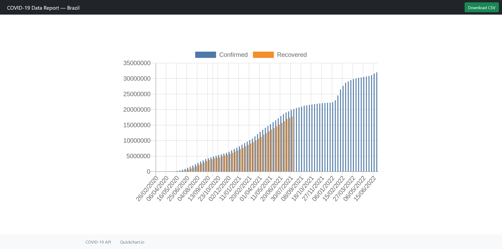

# COVID-19 Data Report Web Application

Aplicação para visualização de dados do número de casos Confirmados e Recuperados 
(de 10 em 10 dias) da COVID-19 no Brasil, exibindo os dados atualizados em um gráfico em barra.

Application for viewing data on the number of Confirmed and Recovered cases
(every 10 days) of COVID-19 in Brazil, displaying the updated data in a bar graph.

## APIs Utilizadas / Used APIs 

- [API COVID-19](https://api.covid19api.com)
- [Quickchart.io](https://quickchart.io)

## Screenshots

